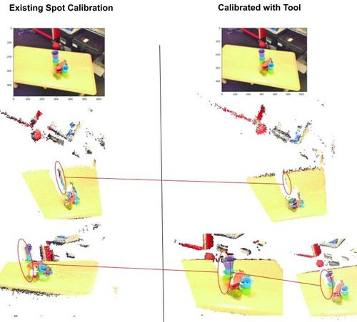
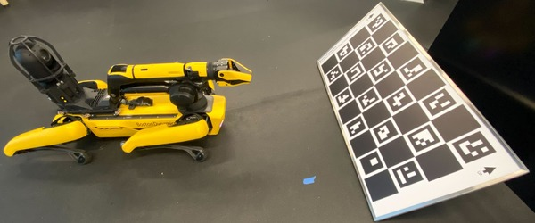

# Automatic Robotic Stereo Camera Calibration with Charuco Target

## Table of Contents

1. [Overview](#overview)
2. [Setup](#setup)
3. [Quick Start](#quick-start)
   - [Full Calibration (collect data + calibrate + optionally push to robot)](#full-calibration)
   - [Calibrate from an Existing Dataset](#calibrate-from-an-existing-dataset)
   - [Push an Existing Calibration YAML to the Robot](#push-an-existing-calibration-yaml-to-the-robot)
4. [Output Format](#output-format)
5. [Check if You Have a Legacy Charuco Board](#check-if-you-have-a-legacy-charuco-board)
6. [All Options](#all-options)

---

## Overview



This utility automates stereo camera calibration for cameras mounted in a fixed configuration on a robot (e.g. the RGB and depth cameras in Spot's hand). It:

- Moves the robot arm through a grid of viewpoints relative to a Charuco calibration target
- Captures synchronized RGB and depth image pairs at each pose
- Runs stereo intrinsic + extrinsic calibration (OpenCV Charuco pipeline)
- Runs hand-eye calibration (OpenCV DANIILIDIS method) to produce `wr1_tform_sensor` transforms for both cameras
- Optionally saves the dataset, the calibration YAML, and/or pushes the result directly to the robot's internal calibration storage via the Spot SDK

For implementation details see `calibration_util.py` (`get_multiple_perspective_camera_calibration_dataset`, `multistereo_calibration_charuco`) and `spot_in_hand_camera_calibration.py` and `calibration_util.py`.

---

## Setup

**Physical setup:**



- Place the Charuco board roughly 0.5–0.6 m in front of the robot's hand, facing the hand camera
- The robot must be **sitting (not docked)** and no one else may hold the robot lease before running

**Board defaults** (matching the standard Spot calibration board):

| Parameter | Default |
|---|---|
| Width (checkers) | 9 |
| Height (checkers) | 4 |
| ArUco dictionary | `DICT_4X4_50` |
| Checker size | 0.115 m |
| Marker size | 0.09 m |

If your board differs, override these via CLI flags (see [All Options](#all-options)).

> [!NOTE]
> If you are using a Spot default calibration board with OpenCV ≥ 4.7, add `--legacy_charuco_pattern`. See [Check if You Have a Legacy Charuco Board](#check-if-you-have-a-legacy-charuco-board).

---

## Quick Start

### Full Calibration

Collect a new dataset, calibrate, and optionally push the result to the robot:

> [!WARNING]
> The robot will move. Ensure it is standing in front of the board, nothing is within ~1 m of the arm, and no other client holds the lease.

```bash
# Collect data, calibrate, save result YAML
python3 spot_wrapper/calibration/calibrate_spot_hand.py \
  --ip <ROBOT_IP> -u <USER> -pw <PASSWORD> \
  --data_path <PATH/TO/DATA/FOLDER> --save_data \
  --result_path <PATH/TO/result.yaml>
```

To also write the calibration directly to the robot's internal storage, add the `--save_to_robot` flag:

```bash
python3 spot_wrapper/calibration/calibrate_spot_hand.py \
  --ip <ROBOT_IP> -u <USER> -pw <PASSWORD> \
  --data_path <PATH/TO/DATA/FOLDER> --save_data \
  --result_path <PATH/TO/result.yaml> --save_to_robot
```

---

### Calibrate from an Existing Dataset

If you have already collected a dataset, you can skip robot movement entirely with `--from_data`. Robot credentials (IP, username, password) are only needed here if you also pass `--save_to_robot`:

```bash
# Calibrate only — no robot needed
python3 spot_wrapper/calibration/calibrate_spot_hand.py \
  --from_data --data_path <PATH/TO/DATA/FOLDER> \
  --result_path <PATH/TO/result.yaml> --legacy_charuco_pattern

# Calibrate and push to robot
python3 spot_wrapper/calibration/calibrate_spot_hand.py \
  --ip <ROBOT_IP> -u <USER> -pw <PASSWORD> \
  --from_data --data_path <PATH/TO/DATA/FOLDER> \
  --result_path <PATH/TO/result.yaml> --legacy_charuco_pattern --save_to_robot
```

**Expected dataset folder structure** (produced by `--save_data`):

```
<data_path>/
  0/          # RGB images: 1.png, 2.png, ...
  1/          # Depth images: 1.png, 2.png, ...
  poses/      # Robot hand poses: 1.npy, 2.npy, ... (4×4 body_T_hand transforms)
```

---

### Push an Existing Calibration YAML to the Robot

If you have a previously computed calibration YAML and only want to upload it to the robot:

```bash
python3 spot_wrapper/calibration/calibrate_spot_hand.py \
  --ip <ROBOT_IP> -u <USER> -pw <PASSWORD> \
  --from_data --from_yaml --result_path <PATH/TO/result.yaml> --save_to_robot
```

> [!NOTE] If you are using a legacy charuco board (Only relevant for OpenCV ≥ 4.7) you should also be adding the `--legacy_charuco_pattern`. More information and how to check is below in [Check if You Have a Legacy Charuco Board](#check-if-you-have-a-legacy-charuco-board).

---

## Output Format

Calibration results are saved as a YAML file with one or more named **tags** (default tag: `default`). This allows multiple calibration runs to coexist in a single file. Password and username are never written to the file.

```yaml
default:
  intrinsic:
    0:                          # RGB camera (origin / parent)
      camera_matrix: [fx, 0, cx, 0, fy, cy, 0, 0, 1]
      dist_coeffs: [k1, k2, p1, p2, k3]
      image_dim: [width, height]
    1:                          # Depth camera (reference / child)
      camera_matrix: [...]
      dist_coeffs: [...]
      image_dim: [...]
  extrinsic:
    0:                          # Keyed by origin camera index
      1:                        # Stereo extrinsic: depth expressed in RGB frame
        R: [...]                # 3×3 rotation, row-major
        T: [...]                # 3-element translation (metres)
      planning_frame:           # Hand-eye result: hand frame expressed in RGB frame
        R: [...]
        T: [...]
  run_params:                   # All CLI flags used (for reproducibility)
    num_images: 135
    timestamp: '2026-03-04 11:19:12'
    ...
  camera_t_body: [...]          # 4×4 homogeneous transform, row-major (16 values)
                                # = RGB camera frame expressed in body/hand frame
```

The `camera_t_body` (or `camera_t_hand`) 4×4 matrix at the top level is the hand-eye calibration result in homogeneous form, provided as a convenience for downstream consumers.

---

## Check if You Have a Legacy Charuco Board

Only relevant for OpenCV ≥ 4.7 — You can check your OpenCV version with:

```bash
python3 -c "import cv2; print(cv2.__version__)"
```

Run the calibration script with `--show_board_pattern` to display the virtual board and compare it visually to your physical board:

```bash
python3 spot_wrapper/calibration/calibrate_spot_hand.py \
  --show_board_pattern --legacy_charuco_pattern
```

Press any key to dismiss the window. The rendered board should match your physical board exactly:
- ArUco tags must match between virtual and physical boards
- The displayed axis should have **Y (green) pointing up**, **X (red) pointing right**, and **Z pointing out of the board**
- If the match looks correct with `--legacy_charuco_pattern`, your board is legacy; if it only matches without it, do not pass the flag

The Spot default calibration board has an ArUco marker in the **top-left corner** — this is a legacy board.

---

## All Options

Print all calibration script options:

```
python3 spot_wrapper/calibration/calibrate_spot_hand.py -h
```

### Calibration target

| Flag | Short | Default | Description |
|---|---|---|---|
| `--legacy_charuco_pattern` | `-l` | off | Use legacy Charuco pattern (required for Spot default board on OpenCV ≥ 4.7) |
| `--show_board_pattern` | | off | Display the virtual board for visual verification before running |
| `--allow_default_internal_corner_ordering` | | off | Skip bottom-left-to-top-right corner ID enforcement (not recommended) |
| `--num_checkers_width` | `-ncw` | `9` | Number of checkers along the board width |
| `--num_checkers_height` | `-nch` | `4` | Number of checkers along the board height |
| `--dict_size` | | `DICT_4X4_50` | ArUco dictionary (see choices in `calibration_clis.py`) |
| `--checker_dim_meters` | `-cd` | `0.115` | Physical checker square size in metres |
| `--marker_dim_meters` | `-md` | `0.09` | Physical ArUco marker size in metres |

### Data collection / viewpoint sweep

| Flag | Short | Default | Description |
|---|---|---|---|
| `--dist_from_board_viewpoint_range` | `-dfbvr` | `0.5 0.6 0.1` | `[start, stop, step]` distances along board normal (metres) |
| `--dist_along_board_width` | `-dabw` | `-0.2 0.3 0.1` | `[start, stop, step]` lateral offsets along board width (metres) |
| `--x_axis_rot_viewpoint_range` | `-xarvr` | `-10 11 10` | `[start, stop, step]` rotations around X axis |
| `--y_axis_rot_viewpoint_range` | `-yarvr` | `-10 11 10` | `[start, stop, step]` rotations around Y axis |
| `--z_axis_rot_viewpoint_range` | `-zarvr` | `-10 11 10` | `[start, stop, step]` rotations around Z axis |
| `--degrees` | `-d` | on | Interpret rotation ranges in degrees (default) |
| `--radians` | `-r` | off | Interpret rotation ranges in radians |
| `--max_num_images` | | `10000` | Cap on total viewpoints visited |
| `--settle_time` | `-st` | `1.0` | Seconds to wait after each move before capturing |
| `--stereo_pairs` | `-sp` | `0,1` | Camera index pairs to calibrate (e.g. `0,1`) |
| `--photo_utilization_ratio` | `-pur` | `1` | Use every Nth collected image for calibration (e.g. `2` = use half) |

### I/O and workflow

| Flag | Short | Default | Description |
|---|---|---|---|
| `--data_path` | `-dp` | `None` | Directory for dataset images/poses, or YAML path when `--from_yaml` |
| `--save_data` | `-sd` | off | Save captured images and poses to `--data_path` |
| `--from_data` | `-fd` | off | Skip data collection; calibrate from existing dataset at `--data_path` |
| `--from_yaml` | `-yaml` | off | Used with `--result_path` to push a saved YAML to the robot |
| `--result_path` | `-rp` | `calibration_result.yaml` | Where to write the calibration YAML |
| `--tag` | `-t` | `default` | Tag name for this run within the YAML file |
| `--unsafe_tag_save` | | off | Skip overwrite confirmation prompts |

### Robot connection (required when connecting to the robot)
and `--save_to_robot`
| Flag | Short | Description |
|---|---|---|
| `--ip` | `-i` / `-ip` | Robot IP address |
| `--user` | `-u` | Robot username |
| `--pass` | `-pw` | Robot password |
| `--spot_rgb_photo_width` | `-dpw` | RGB image width: `640` (default) or `1920` |
| `--spot_rgb_photo_height` | `-dph` | RGB image height: `480` (default) or `1080` |
| `--save_to_robot` | `-save` | Push the computed calibration to the robot's internal storage via Spot SDK |
